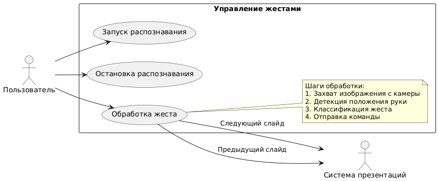
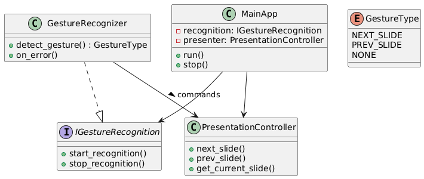
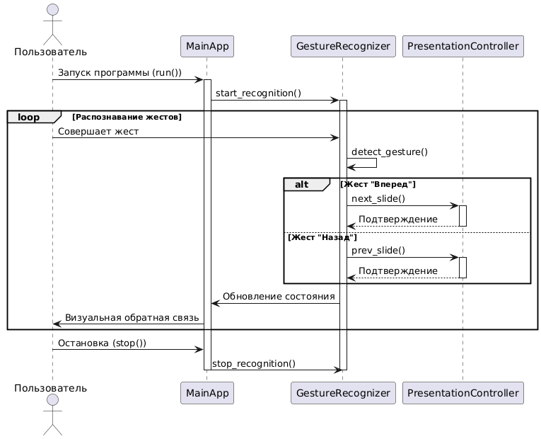
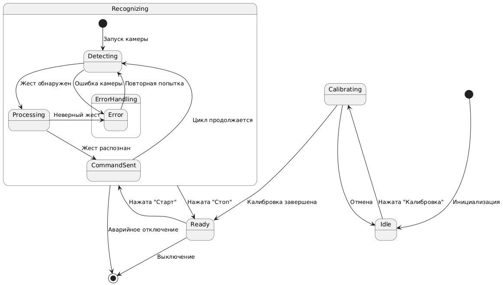
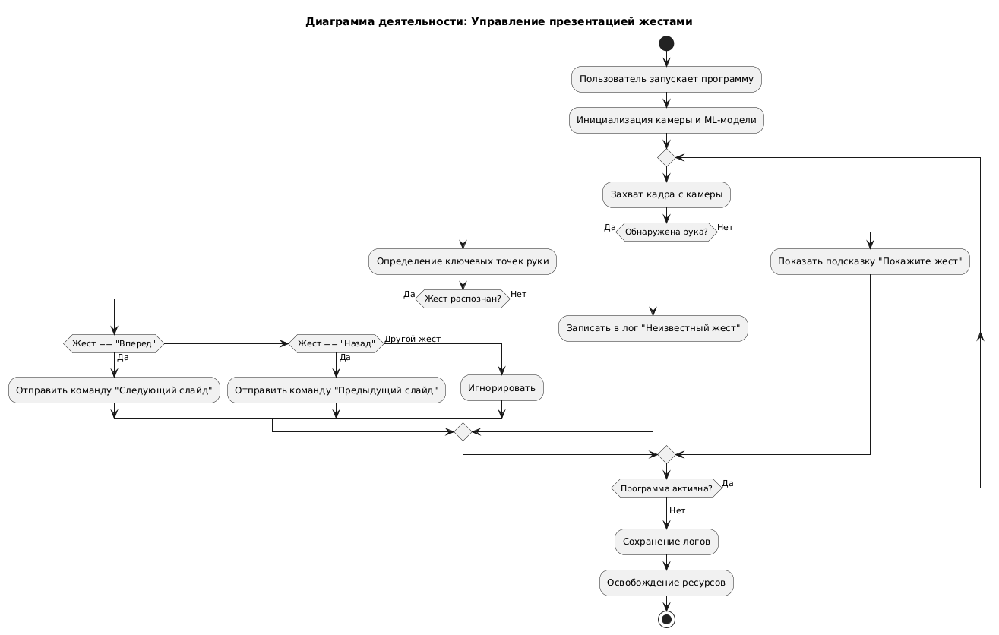

# Диаграммы для ВКР по теме:«Распознавание жестов для управления презентацией»

## Диаграмма вариантов использования (use case diagram)



```uml
@startuml
left to right direction
actor "Пользователь" as user
rectangle "Внешние системы" as external {
  rectangle "Система презентаций" as ppt
}

rectangle "Управление жестами" {
  usecase "Калибровка системы" as calibrate
  usecase "Запуск распознавания" as start
  usecase "Остановка распознавания" as stop
  usecase "Обработка жеста: Следующий слайд" as next
  usecase "Обработка жеста: Предыдущий слайд" as prev
  
  user --> calibrate
  user --> start
  user --> stop
  user --> next
  user --> prev

  next --> ppt : "Команда переключения"
  prev --> ppt : "Команда переключения"
  
  note right of next 
    Шаги обработки:
    1. Захват изображения с камеры
    2. Детекция положения руки
    3. Классификация жеста
    4. Отправка команды
  end note
}
@enduml
```

## Диаграмма классов (classes diagram)



```uml
@startuml
interface IGestureRecognition {
  +start_recognition()
  +stop_recognition()
  +calibrate(settings: CalibrationSettings)
}

class GestureRecognizer {
  +detect_gesture() : GestureType
  +on_error()
  +calibrate(settings: CalibrationSettings)
}
GestureRecognizer ..|> IGestureRecognition

interface IPresentationAPI {
  +next_slide()
  +prev_slide()
  +get_current_slide() : SlideInfo
  +connect(connectionParams: PresentationParams)
  +disconnect()
}

class PowerPointAPI {
  +next_slide()
  +prev_slide()
  +get_current_slide() : SlideInfo
  +connect(connectionParams: PresentationParams)
  +disconnect()
  -send_command(command: PPTCommand)
}
PowerPointAPI ..|> IPresentationAPI

class PresentationController {
  -api: IPresentationAPI
  +next_slide()
  +prev_slide()
  +get_current_slide() : SlideInfo
  +connect_to_presentation()
  +disconnect()
}

class MainApp {
  -recognition: IGestureRecognition
  -presenter: PresentationController
  +run()
  +stop()
  +calibrate_system()
}

enum GestureType {
  NEXT_SLIDE
  PREV_SLIDE
  NONE
}

class CalibrationSettings {
  +sensitivity: float
  +delay: int
  +gesture_thresholds: Map<GestureType, float>
}

class PresentationParams {
  +file_path: string
  +auto_connect: bool
  +slide_timeout: int
}

MainApp --> IGestureRecognition
MainApp --> PresentationController
PresentationController --> IPresentationAPI
GestureRecognizer --> PresentationController : commands >
GestureRecognizer --> CalibrationSettings
PowerPointAPI --> PresentationParams
@enduml
```
Пример кода на Python:

```python
from abc import ABC, abstractmethod
from enum import Enum, auto
from typing import Dict, Optional, NamedTuple

# Перечисления и классы данных
class GestureType(Enum):
    NEXT_SLIDE = auto()
    PREV_SLIDE = auto()
    NONE = auto()

class SlideInfo(NamedTuple):
    number: int
    title: str
    total_slides: int

class CalibrationSettings(NamedTuple):
    sensitivity: float
    delay: int
    gesture_thresholds: Dict[GestureType, float]

class PresentationParams(NamedTuple):
    file_path: str
    auto_connect: bool = True
    slide_timeout: int = 3000

class PPTCommand(Enum):
    NEXT = auto()
    PREV = auto()
    GET_INFO = auto()

# Интерфейсы
class IGestureRecognition(ABC):
    @abstractmethod
    def start_recognition(self):
        pass
    
    @abstractmethod
    def stop_recognition(self):
        pass
    
    @abstractmethod
    def calibrate(self, settings: CalibrationSettings):
        pass

class IPresentationAPI(ABC):
    @abstractmethod
    def next_slide(self):
        pass
    
    @abstractmethod
    def prev_slide(self):
        pass
    
    @abstractmethod
    def get_current_slide(self) -> SlideInfo:
        pass
    
    @abstractmethod
    def connect(self, connection_params: PresentationParams) -> bool:
        pass
    
    @abstractmethod
    def disconnect(self):
        pass

# Реализации
class GestureRecognizer(IGestureRecognition):
    def __init__(self):
        self._is_active = False
        self._settings = CalibrationSettings(1.0, 1000, {
            GestureType.NEXT_SLIDE: 0.8,
            GestureType.PREV_SLIDE: 0.8
        })
    
    def start_recognition(self):
        self._is_active = True
        print("Gesture recognition started")
    
    def stop_recognition(self):
        self._is_active = False
        print("Gesture recognition stopped")
    
    def calibrate(self, settings: CalibrationSettings):
        self._settings = settings
        print(f"Calibration updated: {settings}")
    
    def detect_gesture(self) -> GestureType:
        if not self._is_active:
            return GestureType.NONE
        
        return GestureType.NEXT_SLIDE
    
    def on_error(self):
        print("Error in gesture recognition")
        self.stop_recognition()

class PowerPointAPI(IPresentationAPI):
    def __init__(self):
        self._connection = None
        self._is_connected = False
    
    def connect(self, connection_params: PresentationParams) -> bool:
        try:
            # Имитация подключения к PowerPoint через COM
            print(f"Connecting to PowerPoint with params: {connection_params}")
            self._is_connected = True
            return True
        except Exception as e:
            print(f"Connection error: {e}")
            return False
    
    def disconnect(self):
        if self._is_connected:
            print("Disconnecting from PowerPoint")
            self._is_connected = False
    
    def next_slide(self):
        if self._is_connected:
            print("Showing next slide")
            # Реальная реализация через win32com.client
        else:
            print("Not connected to presentation")
    
    def prev_slide(self):
        if self._is_connected:
            print("Showing previous slide")
        else:
            print("Not connected to presentation")
    
    def get_current_slide(self) -> SlideInfo:
        if self._is_connected:
            return SlideInfo(1, "Title", 10)
        raise ConnectionError("Not connected to presentation")
    
    def _send_command(self, command: PPTCommand):
        """Внутренний метод для отправки команд"""
        print(f"Sending command: {command}")

class PresentationController:
    def __init__(self, api: IPresentationAPI):
        self._api = api
    
    def next_slide(self):
        self._api.next_slide()
    
    def prev_slide(self):
        self._api.prev_slide()
    
    def get_current_slide(self) -> SlideInfo:
        return self._api.get_current_slide()
    
    def connect_to_presentation(self, params: PresentationParams) -> bool:
        return self._api.connect(params)
    
    def disconnect(self):
        self._api.disconnect()

class MainApp:
    def __init__(self):
        self._recognizer = GestureRecognizer()
        self._presenter = PresentationController(PowerPointAPI())
    
    def run(self):
        print("Starting application")
        self._recognizer.start_recognition()
        
        # Имитация работы
        gesture = self._recognizer.detect_gesture()
        if gesture == GestureType.NEXT_SLIDE:
            self._presenter.next_slide()
        elif gesture == GestureType.PREV_SLIDE:
            self._presenter.prev_slide()
    
    def stop(self):
        self._recognizer.stop_recognition()
        self._presenter.disconnect()
        print("Application stopped")
    
    def calibrate_system(self, settings: CalibrationSettings):
        self._recognizer.calibrate(settings)
```


## Диаграмма последовательности (sequence diagram)



```uml
@startuml
actor Пользователь
participant MainApp
participant GestureRecognizer as GR
participant PresentationController as PC

Пользователь -> MainApp : Запуск программы (run())
activate MainApp

MainApp -> GR : start_recognition()
activate GR

loop Распознавание жестов
    Пользователь -> GR : Совершает жест
    GR -> GR : detect_gesture()
    
    alt Жест распознан?
        alt Жест "Вперед"
            GR -> PC : next_slide()
            activate PC
            PC --> GR : Подтверждение
            deactivate PC
            
        else Жест "Назад"
            GR -> PC : prev_slide()
            activate PC
            PC --> GR : Подтверждение
            deactivate PC
        end
        
        GR -> MainApp : Обновление состояния
        MainApp -> Пользователь : Визуальная обратная связь
    
    else Жест не распознан
        GR -> MainApp : Жест не распознан
        MainApp -> Пользователь : Нет реакции
    end
end

Пользователь -> MainApp : Остановка (stop())
MainApp -> GR : stop_recognition()
deactivate GR
deactivate MainApp
@enduml
```

## Диаграмма состояний (state diagram)



```uml
@startuml
[*] --> Idle : Инициализация
Idle --> Calibrating : Нажата "Калибровка"
Calibrating --> Idle : Отмена
Calibrating --> Ready : Калибровка завершена

Ready --> Recognizing : Нажата "Старт"
Recognizing --> Ready : Нажата "Стоп"

state Recognizing {
  [*] --> Detecting : Запуск камеры
  Detecting --> Processing : Жест обнаружен
  Processing --> CommandSent : Жест распознан
  CommandSent --> Detecting : Цикл продолжается
  
  state ErrorHandling {
    Detecting --> Error : Ошибка камеры
    Processing --> Error : Неверный жест
    Error --> Detecting : Повторная попытка
  }
}

Ready --> [*] : Выключение
Recognizing --> [*] : Аварийное отключение
@enduml
```

## Диаграмма  деятельности (activity diagram)



```uml
@startuml
title Диаграмма деятельности: Управление презентацией жестами

start

:Пользователь запускает программу;
:Инициализация камеры и ML-модели;
:Калибровка системы;

repeat
  :Захват кадра с камеры;
  
  if (Обнаружена рука?) then (Да)
    :Определение ключевых точек руки;
    if (Жест распознан?) then (Да)
      if (Жест == "Вперед") then (Да)
        :Отправить команду "Следующий слайд";
      else if (Жест == "Назад") then (Да)
        :Отправить команду "Предыдущий слайд";
      else (Другой жест)
        :Игнорировать;
      endif
    else (Нет)
      :Записать в лог "Неизвестный жест";
    endif
  else (Нет)
    :Показать подсказку "Покажите жест";
  endif
  
repeat while (Программа активна?) is (Да)
->Нет;

:Сохранение логов;
:Освобождение ресурсов;

stop
@enduml
```
